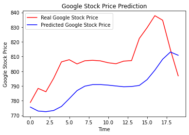

# Stock Price Prediction Using Recurrent Neural Networks

## Overview
This project uses a Recurrent Neural Network (RNN) to predict the stock prices of Google based on historical data. The model is built using Keras, a high-level neural networks API, capable of running on top of TensorFlow, CNTK, or Theano.

## Project Structure
- `Google_Stock_Price_Train.csv`: Training data containing the stock prices from 2012 to 2016.
- `Google_Stock_Price_Test.csv`: Test data containing the stock prices for January 2017.
- `RNN_Stock_Prediction.ipynb`: Jupyter notebook containing all the code and documentation for the project.

## Prerequisites
Before running this project, you need to install the following Python packages:
- `numpy`
- `matplotlib`
- `pandas`
- `keras`
- `tensorflow` or `theano`
- `scikit-learn`

You can install these packages using pip:

pip install numpy matplotlib pandas keras tensorflow scikit-learn

Model
The model consists of four LSTM (Long Short-Term Memory) layers with dropout regularization to prevent overfitting. The model takes sequences of 60 previous stock prices as input to predict the next stock price.

Results
The trained model predicts the stock prices for January 2017 and visualizes them against the actual stock prices to evaluate the model's performance.

Contributing
Contributions to this project are welcome. Please fork the repository and submit a pull request with your changes.
